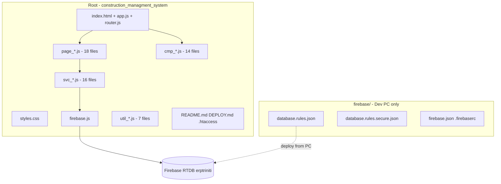
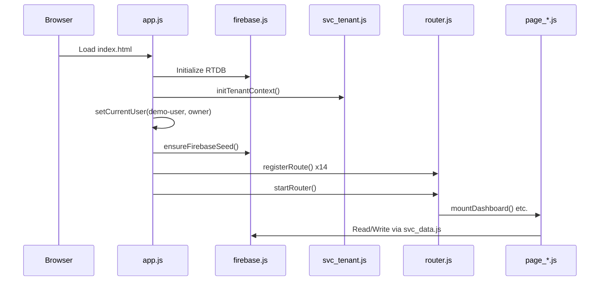

# Triniti ERP — Folder Structure ও Implemented Features (Full Details)

## Project কী?

**Triniti ERP** (`realestate-erp`) একটি **Real Estate / Construction Management ERP** web application। এটি:

- **Frontend-only SPA** (Single Page Application)
- **Vanilla JavaScript** (React/Vue/TypeScript নেই)
- **Firebase Realtime Database (RTDB)** — backend হিসেবে
- **cPanel/LiteSpeed**-এ static file হিসেবে deploy করা হয়
- Live URL: `https://triniti.sellxify.com`
- Build version: `20260524.4`

আগে MySQL + PHP API (`api/` folder) ছিল — সেটা **remove** করা হয়েছে। এখন সব data সরাসরি browser থেকে Firebase-এ যায়।

---

## Folder Structure (Visual)



**মোট ~73 files** — শুধু **একটা subfolder**: `firebase/`

---

## Root Level Files (Core)

| File | কাজ |
|------|-----|
| `index.html` | SPA entry — `#app` div, `app.js` load, default route `#/dashboard` |
| `app.js` | App bootstrap, Firebase init, route registration, demo user set, offline sync start |
| `router.js` | Hash-based routing (`#/dashboard`, `#/projects`, etc.) |
| `firebase.js` | Firebase app init, RTDB connection (`erptriniti`), CRUD helpers export |
| `styles.css` | Global CSS (~2600 lines) — sidebar, cards, tables, all page styles |
| `version.js` | Build version stamp |
| `package.json` | esbuild dev dependency, `npm run build` script |
| `.htaccess` | Apache/LiteSpeed cache + routing config |
| `README.md` | cPanel upload instructions (45 files) |
| `DEPLOY.md` | Detailed deploy guide |

---

## Naming Convention (File Prefix System)

প্রজেক্টে **folder নেই**, বরং **prefix দিয়ে organize**:

| Prefix | Count | Role | Example |
|--------|-------|------|---------|
| `page_` | 18 | Route/page screens | `page_dashboard.js`, `page_projects.js` |
| `cmp_` | 14 | Reusable UI components | `cmp_layout.js`, `cmp_table.js` |
| `svc_` | 16 | Business logic + Firebase ops | `svc_data.js`, `svc_auth.js` |
| `util_` | 6 | Formatting & domain helpers | `util_format.js`, `util_procurement.js` |

---

## `firebase/` Subfolder (Upload করা হয় না cPanel-এ)

| File | Purpose |
|------|---------|
| `firebase/database.rules.json` | **Demo rules** — open read/write (`.read: true`, `.write: true`) |
| `firebase/database.rules.secure.json` | Production rules — auth required, role-based writes |
| `firebase/firebase.json` | Firebase CLI config |
| `firebase/.firebaserc` | Firebase project ID |
| `firebase/FIREBASE_SECURE.md` | Security hardening notes |
| `firebase/FIREBASE_CPANEL.md` | cPanel integration notes |

Deploy command (dev PC থেকে):

```bash
cd firebase && firebase deploy --only database
```

---

## App Boot Flow



---

## Registered Routes (15 Main Pages)

| Route | File | Feature |
|-------|------|---------|
| `#/dashboard` | `page_dashboard.js` | KPI metrics, cash flow chart, recent transactions, quick actions |
| `#/customers` | `page_customers.js` | Customer CRM — directory, CRUD, filters, linked units |
| `#/projects` | `page_projects.js` | Project hub — sidebar list, tabs, workflow |
| `#/projects/new` | `page_project_create.js` | 3-step wizard — type, form, review |
| `#/sales` | `page_sales.js` | Unit booking — customer + unit + down payment |
| `#/accounting` | `page_accounting.js` | Chart of accounts, manual vouchers, history |
| `#/purchases` | `page_purchases.js` | Procurement — Material Request → PO → GRN |
| `#/suppliers` | `page_suppliers.js` | Supplier hub — 9 tabs (bills, payments, products, etc.) |
| `#/inventory` | `page_inventory.js` | Materials, stock in/out, ledger, pending returns, low stock |
| `#/assets` | `page_assets.js` | Asset register, assignment, maintenance |
| `#/workers` | `page_workers.js` | Worker list, profile, attendance, salary |
| `#/site-incharge` | `page_site_incharge.js` | Field PM — material logs, roster, settlement |
| `#/approvals` | `page_approvals.js` | Enterprise approval inbox |
| `#/arbitration` | `page_arbitration.js` | Disputes, cases, hearings, awards |
| `#/reports` | `page_reports.js` | Stats, cost/governance reports |
| `#/settings` | `page_settings.js` | Company profile, backup trigger |

**Extra (not in main nav):**

- `page_login.js` — Login **disabled** (demo mode auto-login)
- `page_projects_r2.js` — BOQ, Progress, Resources tabs
- `page_projects_r3.js` — Quality, Safety, Contracts & Claims
- `page_projects_gov.js` — Govt civil: Measurement, IPC, Retention

---

## UI Components (`cmp_*.js`)

| File | Role |
|------|------|
| `cmp_layout.js` | App shell — sidebar nav (14 items), main content area |
| `cmp_header.js` | Top bar — search, tenant switcher, notifications |
| `cmp_ui.js` | Metric cards, chips, progress bars, cash flow chart |
| `cmp_table.js` | Generic data table renderer |
| `cmp_toast.js` | Toast notifications |
| `cmp_icons.js` | SVG icon set |
| `cmp_projectHub.js` | Project detail hub — sidebar, KPIs, grouped tabs |
| `cmp_projectForm.js` | Project create wizard UI |
| `cmp_projectTab.js` | Project tab helpers — forms, dialogs, validation |
| `cmp_procurement.js` | PO composer, GRN receive form |
| `cmp_supplierHub.js` | Supplier hub — KPIs, tabs, pagination |
| `cmp_siteInchargeHub.js` | Site in-charge hub UI |

---

## Services / Business Logic (`svc_*.js`)

| File | Implemented Features |
|------|---------------------|
| `svc_data.js` | Primary CRUD layer — get, create, update, remove, realtime listeners |
| `svc_clientCache.js` | In-memory cache from Firebase snapshots |
| `svc_tenant.js` | Multi-tenant — Triniti + Lake View, scoped paths |
| `svc_auth.js` | Session user (demo only, no real login) |
| `svc_sync.js` | Offline queue — enqueue when offline, replay on reconnect |
| `svc_firebaseOps.js` | Seed data, voucher posting, sale booking |
| `svc_operations.js` | Reports cache refresh, backup, project cost cache |
| `svc_projectCost.js` | BOQ, budget summary, expense posting |
| `svc_govProject.js` | Govt projects — IPC bills, measurement, LD, EOT, retention |
| `svc_governance.js` | Approvals, RBAC, quality/safety/change-order workflow |
| `svc_workflow.js` | State transitions (draft→approved→closed), audit logs |
| `svc_supplier.js` | Supplier CRUD, bills, FIFO payments, AP vouchers |
| `svc_siteIncharge.js` | Site logs, roster, settlements, assignments |
| `svc_arbitration.js` | Dispute lifecycle — draft→hearing→award→closed |

---

## Utilities (`util_*.js`)

| File | Purpose |
|------|---------|
| `util_format.js` | Currency, date, number formatting |
| `util_procurement.js` | MR/PO/GRN helpers |
| `util_projectCost.js` | BOQ line calculations |
| `util_projectForm.js` | Project form validation/helpers |
| `util_govProject.js` | Govt project phases, mandatory docs |
| `util_supplier.js` | Bill balance, vendor normalization |
| `util_siteIncharge.js` | Site in-charge tab definitions |

---

## Firebase Data Model

**Global paths** (সব tenant share):
`accounts`, `vouchers`, `companyProfile`, `roles`, `rolePermissions`, `counters`, `tenants`, `reportsCache`, `offlineQueue`, `syncConflicts`, `payrollEntries`

**Tenant-scoped paths** (`tenantData/{tenantId}/`):
`projects`, `customers`, `units`, `sales`, `purchases`, `suppliers`, `boqItems`, `ipcBills`, `arbitrationCases`, `siteInCharges`, `qualityChecks`, `safetyIncidents`, etc.

**Demo tenants:**

- `tenant_triniti` (default)
- `tenant_lakeview`

---

## Implemented Business Features (Summary)

### 1. Dashboard & Overview

- Receivables, sales, due payment KPIs
- Cash flow chart
- Recent transactions
- Quick action links

### 2. Customer Management (CRM)

- Customer directory with search/filter
- Add/Edit/View customers
- Unit linkage

### 3. Project Management (Full Lifecycle)

- Residential + Commercial + Government civil projects
- **Overview tabs:** Home, Units, Phases, Milestones, Documents, Activity
- **R2 tabs:** BOQ & Budget, Progress, Resources
- **R3 tabs:** Quality, Safety, Contracts & Claims
- **Gov tabs:** Contract, Dashboard, Measurement & IPC, Retention & Final
- Project create wizard (3 steps)
- Status workflow (draft → submitted → approved)

### 4. Sales

- Unit booking with down payment

### 5. Accounting

- Chart of accounts (cash, bank, income, expense, AP)
- Double-entry voucher posting (journal/payment/receipt)
- Manual debit/credit vouchers
- Sequence counters (`VCH-`, `RCP-`)

### 6. Procurement

- Material Request (MR) → Purchase Order (PO) → Goods Receipt (GRN)
- Per-project procurement workflow

### 7. Supplier/Vendor Management

- Supplier hub with 9 tabs: Overview, Profile, Products, Payments, Projects, Reports, Documents, Notes, Activity
- Bills, FIFO payment allocation
- AP integration via vouchers

### 8. Workers (expanded)

- Worker list with search/filters, profile drill-down
- Attendance grid, salary/advance/payslip
- Items issued linked from inventory stock-out

### 9. Inventory

- Material list, stock in/out with worker tracking
- Stock ledger, pending returns, low stock alerts

### 10. Assets

- Asset register with status filters
- Assignment transfers, maintenance log

### 11. Site In-charge (Field Operations)

- Material logs
- Worker roster
- Monthly settlement
- Project assignments

### 10. Governance & Approvals

- Enterprise approval inbox
- Role-based permissions: owner, manager, site_engineer, accountant, viewer
- Quality checks, safety incidents, change orders, contract claims

### 11. Arbitration & Disputes

- Case lifecycle: draft → submitted → review → hearing → award → closed
- Hearing scheduling, award recording

### 12. Reports

- Daily summary, receivables, monthly expense
- CSV export (due/collections)
- Project cost, governance metrics
- Multi-tenant reports

### 13. Settings

- Company profile edit
- Backup trigger

### 14. Infrastructure Features

- Multi-tenant data isolation
- Offline operation queue + sync on reconnect
- Client-side cache hydration
- Demo data seeding on first connect
- Tenant switcher in header

---

## Tech Stack

| Layer | Technology |
|-------|------------|
| Language | Vanilla JavaScript (ES modules) |
| UI | Plain DOM manipulation (no framework) |
| Routing | Custom hash router |
| Database | Firebase RTDB v11.2.0 (CDN) |
| Auth | Demo session only (Firebase Auth not wired) |
| Build | esbuild → `app.bundle.js` |
| Deploy | Static files on cPanel/LiteSpeed |
| Fonts | Google Fonts (Inter) |

---

## What's NOT in This Folder

- `scripts/` — build scripts (referenced in package.json, not in this deploy copy)
- `dist/` — production bundle output
- `api/` — removed legacy MySQL PHP API
- `database/` — removed MySQL schema
- `assets/` — removed legacy asset folder
- Firebase Cloud Functions — recommended in docs but not in repo
- Real authentication — login bypassed in demo mode
- User management UI — not exposed in nav

---

## Deploy Process (cPanel)

1. cPanel File Manager → `public_html`
2. Delete old: `api/`, `svc_api.js`, `database/`, `assets/`
3. Upload **all root files except** `README.md` and `firebase/` folder (~45 files)
4. LiteSpeed Cache → Purge All
5. Browser hard refresh on live site

Production uses `app.bundle.js` (bundled); dev uses individual `.js` files.

---

## Security Status (Current)

- **Demo mode:** Open Firebase rules (anyone can read/write)
- **Login disabled:** Hardcoded demo user (`demo-user`, role `owner`)
- **RBAC:** Client-side only (not server-enforced)
- **Production path:** Deploy `database.rules.secure.json` + Firebase Auth + Cloud Functions (documented in `FIREBASE_SECURE.md`)
