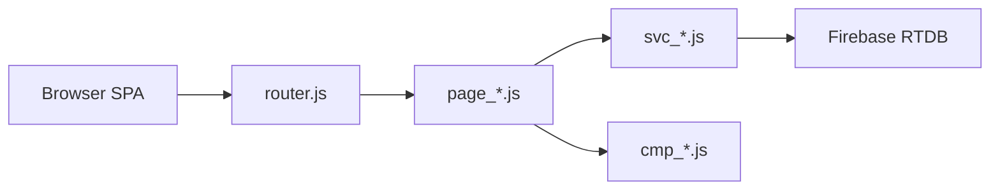

# Construction ERP — Triniti

**End-to-end construction company management platform** — projects, procurement, inventory, HR & payroll, billing, approvals, and reports in a single real-time web application.

[](https://constructionerp-delta.vercel.app/)
[](https://developer.mozilla.org/en-US/docs/Web/JavaScript)
[](https://firebase.google.com/docs/database)
[](https://constructionerp-delta.vercel.app/)

**[Live Demo](https://constructionerp-delta.vercel.app/)** · **[GitHub Repository](https://github.com/himel2535/construction_management_system)** · **Build `20260526.3`**

---

## About

**Triniti** is a full-stack construction and real estate ERP built as a **vanilla JavaScript SPA** with no frontend framework. It covers the complete lifecycle of a construction business — from contract and BOQ setup through site execution, procurement, payroll, billing, and financial reporting.

Data is stored in **Firebase Realtime Database** with multi-tenant support, role-based navigation, and an offline sync queue for field use.

---

## Key Highlights

| Area | Highlights |
|------|------------|
| **Projects** | Government and private projects, BOQ, milestones, progress tracking, project billing |
| **Supply chain** | Suppliers, purchase orders, GRN, inventory, issue vouchers |
| **HR & site** | Worker directory, attendance, payroll, site diary, site incharge |
| **Finance** | Billing, accounting, budget vs actual, profit & loss |
| **Approvals** | Central role-based approval queue for expenses, POs, and bills |
| **Real-time** | Firebase RTDB, multi-tenant architecture, offline sync queue |

---

## Modules

| Module | Route | Description |
|--------|-------|-------------|
| Dashboard | `/dashboard` | KPIs, cash flow chart, pending approvals, attention alerts |
| Projects | `/projects` | Project hub — contract, BOQ, team, milestones, billing |
| Site Management | `/site-incharge` | Site diary, material log, daily progress |
| Clients / Contacts | `/clients` | Client directory and linked projects |
| Procurement | `/purchases` | Material requests, PO, GRN workflow |
| Suppliers | `/suppliers` | Vendor ledger and payment aging |
| Inventory | `/inventory` | Stock in/out, catalog, reorder alerts |
| HR & Payroll | `/workers` | Worker directory, attendance, salary |
| Assets & Equipment | `/assets` | Asset register, assignment, maintenance |
| Billing | `/billing` | Invoices, collections, overdue tracking |
| Finance | `/accounting` | Revenue, expenses, manual vouchers |
| Approvals | `/approvals` | Central approval queue |
| Reports | `/reports` | Project cost, analytics, worker payroll |
| Client Portal | `/client-portal` | Client-facing project progress and billing |
| Settings | `/settings` | Users, roles, company profile |

Additional routes: `/projects/new`, `/clients/new`, `/reports/project-cost`, `/reports/analytics`, `/reports/worker-payroll`, `/arbitration`.

---

## User Roles

| Role | Primary access |
|------|----------------|
| **Owner / Admin** | Full access — all modules, users, and permissions |
| **Project Manager** | Dashboard, clients, projects, workers, site management, procurement, approvals, reports |
| **Site Engineer** | Dashboard, projects, site management, approvals |
| **Site Supervisor** | Dashboard, projects, site management, workers |
| **Accountant / Finance** | Dashboard, clients, billing, accounting, reports, approvals |
| **Procurement Officer** | Dashboard, procurement, suppliers, inventory, reports |
| **Client (Portal)** | Client portal and settings only |
| **Viewer** | Dashboard, reports, settings (read-only) |

Role definitions and route guards live in [`util_roles.js`](util_roles.js).

---

## Tech Stack

| Layer | Technology |
|-------|------------|
| Frontend | Vanilla JavaScript (ES Modules) — no React, Vue, or TypeScript |
| Styling | Custom CSS with design tokens (~17K lines) |
| Backend | Firebase Realtime Database (`erptriniti`) |
| Routing | Custom SPA router (History API) |
| Deploy | Vercel (demo) + cPanel static bundle (production) |
| Build | esbuild (optional production bundle) |

### Architecture



---

## Project Structure

The codebase uses a **flat, prefix-based layout** (no nested `src/` folder):

| Prefix | Role | Examples |
|--------|------|----------|
| `page_` | Route screens | `page_dashboard.js`, `page_inventory.js` |
| `cmp_` | UI components | `cmp_layout.js`, `cmp_table.js` |
| `svc_` | Business logic + Firebase | `svc_data.js`, `svc_auth.js` |
| `util_` | Helpers | `util_roles.js`, `util_format.js` |

Core entry points: [`index.html`](index.html) · [`app.js`](app.js) · [`router.js`](router.js) · [`firebase.js`](firebase.js) · [`styles.css`](styles.css)

For a full feature and folder reference, see [`PROJECT_STRUCTURE.md`](PROJECT_STRUCTURE.md).

---

## Getting Started

### Prerequisites

- [Node.js](https://nodejs.org/) 18+ (local dev and production build only)
- Firebase RTDB project configured in [`firebase.js`](firebase.js)

### Local development

```bash
git clone https://github.com/himel2535/construction_management_system.git
cd construction_management_system
npm install
npm run dev
```

Open [http://localhost:3000](http://localhost:3000). The app connects to Firebase Realtime Database on boot.

> **Security note:** Demo mode may use open RTDB rules. Do not store sensitive production data until Firebase Auth and secure rules are deployed. See [`firebase/FIREBASE_SECURE.md`](firebase/FIREBASE_SECURE.md).

---

## Deployment

### Vercel (live demo)

The current demo at [constructionerp-delta.vercel.app](https://constructionerp-delta.vercel.app/) is a static deploy configured in [`vercel.json`](vercel.json):

- Serves files from the repo root
- SPA rewrite: all routes → `index.html`
- No build step required

### cPanel (production bundle)

For production on shared hosting, build a minified bundle and upload to `public_html`. See [`DEPLOY.md`](DEPLOY.md) for the full ZIP upload workflow, file list, and hotfix steps.

---

## Documentation

| Resource | Description |
|----------|-------------|
| [Live Demo](https://constructionerp-delta.vercel.app/) | Hosted on Vercel |
| [GitHub Repository](https://github.com/himel2535/construction_management_system) | Source code |
| [`PROJECT_STRUCTURE.md`](PROJECT_STRUCTURE.md) | Full folder and feature reference |
| [`DEPLOY.md`](DEPLOY.md) | cPanel and bundle deploy guide |
| [`presentation_documentation.html`](presentation_documentation.html) | Office presentation document (Bangla) |
| [`firebase/FIREBASE_SECURE.md`](firebase/FIREBASE_SECURE.md) | Production security checklist |

---

## Author

Built by [**himel2535**](https://github.com/himel2535)

**Version:** `20260526.3`
